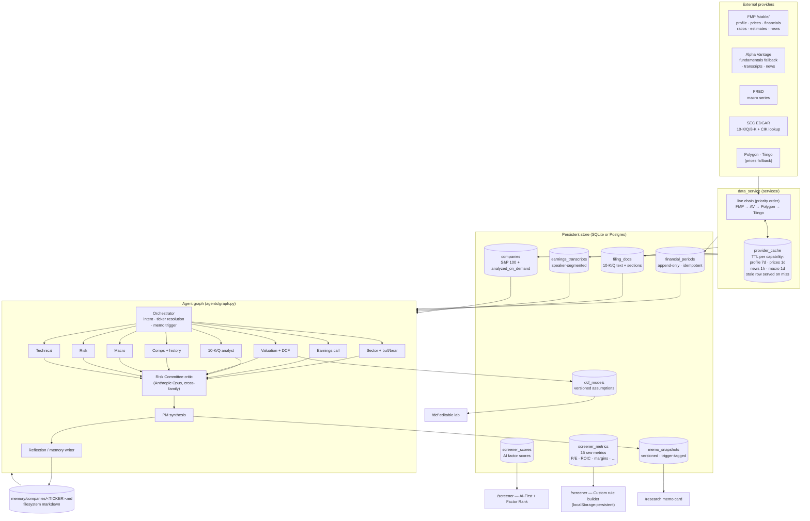

# MarketMosaic — Your AI Investment Committee

> Multi-agent equity research platform. Eight specialist agents (sector with integrated
> bull/bear, earnings, filings, valuation, comps with self-historical lens, macro, risk,
> technical) collaborate under a Portfolio Manager orchestrator to produce versioned,
> lineage-aware memos with persistent DCF models, structured screening, and a long-term
> memory that learns across runs.

> **Disclaimer.** Research and education only. No personalized financial / investment /
> legal / tax advice. Model portfolios and stock analyses are illustrative and
> scenario-based. Conduct your own diligence or consult a qualified advisor before acting.

---

## What it does

| Workflow | Page | Backed by |
|---|---|---|
| Single-stock memo (any ticker, with typeahead picker) | `/research` | `agents/graph.py::run_stock_memo` |
| Three screener views — AI rank · factor rank · custom rule builder | `/screener` | `services/screener_service.py` + `services/screener_metrics_service.py` |
| Editable DCF lab + sensitivity tables | `/dcf` | `finance/dcf.py` + `services/dcf_store.py` |
| Comps with self-historical lens | `/comps` | `finance/comps.py` + `finance/comps_history.py` |
| Macro scenario analysis | `/macro` | `agents/macro_agent.py` |
| Conversational PM (8 tools — memo / DCF / comps / macro / universe / screener / custom screen) | `/chat` | `agents/orchestrator.py` + `agents/chat_sdk.py` |
| Scenario-based portfolio builder | `/portfolio` | `finance/portfolio_construction.py` |

The **curated screener universe** is the S&P 100, pre-analyzed nightly. Any ticker outside
it is researchable on demand: typing it into `/research` triggers a profile lookup, a
5-year financial backfill (including 10-K + 10-Q + 8-K body text from SEC EDGAR and four
quarters of transcripts from Alpha Vantage), and a full agent run. Subsequent reads are
served from cache until a new filing or earnings transcript invalidates the memo.

The **PM chat** routes follow-up turns and conceptual questions ("which has the strongest
moat?", "show me cheap software with margins above 70%") through an OpenAI Agents SDK
agent with eight tools — `get_memo`, `get_dcf_summary`, `get_comps`, `get_macro_snapshot`,
`get_company_lite`, `list_universe`, `screener_query`, `custom_screen`. Workflow handlers
still fire for unambiguous first-message asks ("Analyze NVDA", "Build a 10-stock
portfolio") so the heavy memo path runs only when the user wants it.

---

## Architecture — agent + data flow



### How a memo run flows end-to-end

1. **Resolve.** User submits ticker `T`. If `T` already exists in `companies`, skip ahead.
   Otherwise the route hits the live profile chain (FMP `/stable/profile` → Alpha Vantage
   `OVERVIEW` → SEC ticker map for CIK), inserts an `analyzed_on_demand` row, and runs
   `history_service.backfill_ticker(T)` so financials (FMP `/stable/income-statement` etc.,
   AV `INCOME_STATEMENT` fallback), filings (10-K + 10-Q + 8-K body text from SEC EDGAR;
   `Item N` headers parsed into `business_description` / `mda` / `risk_factors`), and four
   quarters of earnings call transcripts (AV `EARNINGS_CALL_TRANSCRIPT`) are loaded before
   any agent fires.
2. **Cached?** Existing memo + freshness check (`memo_store.memo_freshness`). A memo is
   **stale** iff a 10-K / 10-Q / 8-K filing or earnings transcript has landed since it was
   generated. Fresh memos return immediately with `X-Memo-Source: cache` headers.
3. **Fan-out.** The orchestrator dispatches the eight specialist agents in parallel. Each
   emits a Pydantic-validated finding (headline, summary, signals, confidence, citations).
   The filing analyst reads up to 12K chars of MD&A + 6K of risk factors per filing; the
   earnings analyst reads up to 10K of prepared remarks + 8K of Q&A.
4. **Critic.** Anthropic Opus 4.7 (cross-family critic) reviews the draft, surfaces
   challenges, and proposes targeted revisions. Specialists may re-fire when deep-research
   mode is on (`ENABLE_DEEP_RESEARCH=true`).
5. **Synthesize.** The PM produces the final memo (rating, thesis, scenarios, risks). DCF is
   rebuilt and persisted as a new `dcf_models` version with an `assumption_changes` audit
   trail. Bull / bear case fallbacks lift signal lines from agent findings rather than
   demo-only profile fields, so live-data memos render real Tailwind / Headwind points.
6. **Persist + reflect.** A new versioned `memo_snapshots` row is tagged with the trigger
   (`first_run` / `full_reanalysis` / `incremental_patch` / `force_refresh` / `scheduled`).
   Reflection writes deltas into `memory/companies/<TICKER>.md` for future runs to read.

### Three-tier cache architecture

| Tier | Tables | Refresh policy |
|---|---|---|
| **A · Permanent** | `financial_periods`, `filing_docs`, `earnings_transcripts`, `memo_snapshots`, `dcf_models` | Append-only. New rows arrive when a new filing or earnings call lands. |
| **B · Event-driven** | (memo regeneration on read) | Memo is recomputed when filing / transcript dates exceed `memo.generated_at`, or the user clicks "Re-run research". |
| **C · TTL** | `provider_cache` | Per-capability TTLs (profile 7d, prices 1d, news 1h, macro 1d). Stale rows are served when the provider also misses, so the platform degrades gracefully. |

---

## Stack

| Layer | Tech |
|---|---|
| Backend | FastAPI · Pydantic v2 · SQLAlchemy 2 · httpx · uvicorn |
| Frontend | React 18 · TypeScript · Vite · Tailwind · Recharts |
| LLMs | OpenAI (`gpt-5.5` strong / `gpt-4.1-mini` cheap) · Anthropic (`opus-4-7` critic / `haiku-4-5` cheap) · Vertex Gemini (optional, for news/long-doc) |
| Database | SQLite default · Postgres via `DATABASE_URL=postgresql+psycopg2://…` |
| Agent runtime | Hand-rolled graph (`agents/graph.py`) or OpenAI Agents SDK (`USE_AGENTS_SDK=true`) |
| Scheduler | APScheduler — nightly `history_backfill`, `outcome_loop`, `edgar_poller`, GC jobs |

---

## Agent roster

| Agent | File | Role |
|---|---|---|
| Orchestrator | `agents/orchestrator.py` | Intent classification, ticker resolution, memo trigger |
| Sector + bull/bear | `agents/sector_agents.py` | Sector framework via `data/sector_configs.json`. Bear-first construction with falsifiable tests. |
| Earnings call | `agents/earnings_agent.py` | Tone, segment commentary, guidance changes |
| Filing | `agents/filing_agent.py` + `fact_extraction.py` | 10-K / Q risk factors, MD&A, structured fact extraction |
| Valuation | `agents/valuation_agent.py` + `finance/dcf.py` | DCF with scenarios + sensitivity; persisted via `services/dcf_store.py` |
| Comps | `agents/comps_agent.py` + `finance/comps_history.py` | Peer multiples + self-historical lens |
| Macro | `agents/macro_agent.py` | Scenario template (soft landing / sticky inflation / recession) |
| Risk | `agents/risk_agent.py` | Drawdown, beta, debt structure |
| Technical | `agents/technical_agent.py` | Positioning context only — does **not** influence rating |
| Critic | `agents/critic_agent.py` | Cross-family Opus review of the draft memo |
| News-impact | `agents/news_impact_agent.py` | Decides whether breaking news is material; emits `incremental_patch` snapshots |
| Reflection | `agents/reflection_agent.py` | Appends entries to long-term memory on delta events |
| Long-form | `agents/long_form.py` | Per-tile markdown drill-down reports |
| Deep research | `agents/deep_research.py` | PM ↔ specialist multi-round Q&A loop (opt-in) |
| Portfolio | `agents/portfolio_agent.py` + `finance/portfolio_construction.py` | Scenario-based model portfolios |

Every agent has a Pydantic-typed schema in `schemas.py`. When `OPENAI_API_KEY` /
`ANTHROPIC_API_KEY` is unset, agents fall back to deterministic stubs that return the same
schema (used in tests; production always has keys configured).

---

## Universe model

Three tiers in the `companies.universe_tier` column. Dual-class names (Alphabet GOOG /
GOOGL, Berkshire BRK.A / BRK.B) are listed once — FMP returns inconsistent per-class
market caps for the two classes, which would distort every price-derived metric. Picked
GOOGL (Class A, voting) and BRK.B (lower-priced, more retail-tradeable) as the canonical
tickers. See [`backend/app/data/sp100.json`](backend/app/data/sp100.json)
`_dual_class_policy` for the rationale.

| Tier | Population | How it's used |
|---|---|---|
| `auto_analysis` | S&P 100 (curated, [`backend/app/data/sp100.json`](backend/app/data/sp100.json)) | Pre-scored nightly. Drives the screener. |
| `analyzed_on_demand` | Anything the user has researched | Lazy-introduced via FMP profile lookup. Has a memo + DCF; not in the screener. |
| `data_only` | Legacy / demoted | Has metadata but no memo. Not eligible for auto-analysis. |

The S&P 100 list is a static snapshot — review and refresh it periodically (S&P revises
constituents a few times a year).

---

## Quickstart

```bash
# Backend
cd backend
python -m venv .venv && source .venv/bin/activate
pip install -r requirements.txt
cp ../example.env ../.env          # add API keys; everything else has defaults
uvicorn app.main:app --reload --port 8000

# Frontend
cd ../frontend
npm install
npm run dev                         # localhost:5173

# Backend tests
cd ../backend
python -m pytest -q
```

First boot runs the lightweight S&P 100 seed (~100 FMP `/profile` calls, ~30s). Trigger the
heavy financial backfill explicitly when you want full coverage:

```bash
# Re-seed the S&P 100 universe (admin endpoint)
curl -X POST 'localhost:8000/api/seed-universe?refresh=true'

# Pull 5y financials + filings + transcripts for all 100 tickers (~600 calls, 3-5 min)
python -c "from app.monitoring.history_backfill import run_once; print(run_once())"
```

---

## Configuration

Two layered files. Process env wins over both.

| File | Purpose | In git? |
|---|---|---|
| `config.env` | Model assignments, feature flags, runtime tuning | yes |
| `.env` | API keys, `DATABASE_URL`, per-deployment overrides | no (gitignored) |

Required for live mode:

| Variable | Use |
|---|---|
| `OPENAI_API_KEY` *and/or* `ANTHROPIC_API_KEY` | Agent LLM calls |
| `FMP_API_KEY` | Profiles, financials, ratios, prices, estimates, news (`/stable/` namespace) |
| `ALPHA_VANTAGE_API_KEY` | Earnings transcripts; financials fallback when FMP misses |
| `FRED_API_KEY` | Macro series |
| `SEC_USER_AGENT` | Required by SEC EDGAR (no API key, just an identifier string) |

Optional fallbacks: `POLYGON_API_KEY`, `TIINGO_API_KEY` (additional prices/news providers).

LLM provider selection:

```bash
LLM_PROVIDER=auto         # auto | openai | anthropic
                          # auto picks Anthropic when its key is set, else OpenAI
USE_AGENTS_SDK=true       # route memos through the OpenAI Agents SDK runtime
ENABLE_DEEP_RESEARCH=true # PM ↔ specialist multi-round dialog
```

Verify what's wired at runtime:

```bash
curl localhost:8000/api/providers/status | jq .
```

---

## Operational endpoints

| Endpoint | Purpose |
|---|---|
| `GET /health` | Liveness probe |
| `GET /api/providers/status` | Per-provider configured/healthy state + active LLM provider |
| `POST /api/seed-universe?refresh=…` | Re-seed S&P 100 from FMP profile |
| `GET /api/admin/monitoring/status` | Last-run snapshot for every scheduler loop |
| `GET /api/admin/llm-metrics` | Aggregate token / cost trail (last N days) |
| `GET /api/admin/sdk-traces` | OpenAI Agents SDK exchange traces (when SDK runtime is on) |
| `GET /api/admin/track-record` | Memo rating accuracy vs. realized forward returns |
| `POST /api/screener/custom` | Rule-based screen against `screener_metrics` |

---

## Repo layout

```
.
├── docs/
│   ├── UNIVERSE_DESIGN.md          # universe refactor design + changelog
│   ├── DEEP_RESEARCH_DESIGN.md
│   └── …
├── config.env                      # committed defaults
├── example.env                     # template for .env
├── Dockerfile / docker-compose.yml
├── backend/app/
│   ├── main.py                     # FastAPI factory + startup seed
│   ├── seed_universe.py            # S&P 100 seeder (idempotent)
│   ├── agents/                     # PM, specialists, critic, reflection, deep-research
│   ├── api/                        # Route modules
│   ├── data/
│   │   ├── sp100.json
│   │   ├── sector_configs.json
│   │   └── peer_groups.json
│   ├── finance/                    # DCF · comps · ratios · risk · portfolio · technicals
│   ├── monitoring/                 # APScheduler jobs (backfill, EDGAR poller, outcome loop, GC)
│   ├── providers/                  # FMP /stable/, Alpha Vantage, FRED, SEC EDGAR, Polygon, Tiingo
│   ├── services/
│   │   ├── data_service.py         # Provider facade w/ read-through cache
│   │   ├── provider_cache.py       # TTL cache helper
│   │   ├── history_service.py      # Backfill + read API for permanent tables
│   │   ├── memo_store.py           # Versioned memo persistence + freshness check
│   │   ├── dcf_store.py
│   │   └── screener_metrics_service.py
│   └── tests/
│       ├── conftest.py             # Auto-injects DemoProvider for deterministic tests
│       └── fixtures/               # Demo dataset (test-only)
└── frontend/src/
    ├── pages/
    │   ├── Screener.tsx            # Tabbed: AI-First · Factor Rank · Custom Screen
    │   ├── Research.tsx
    │   ├── DCFLab.tsx
    │   └── …
    └── api/client.ts
```

---

## Deployment

Single Docker image bundles backend + frontend dist:

```bash
docker build -t marketmosaic .
docker run --rm -p 8000:8000 --env-file .env marketmosaic
```

Cloud deploy: any platform that runs the root `Dockerfile` (Render / Railway / Fly /
Cloud Run). Bind port 8000. Persistent volume only if you want SQLite to survive restarts;
for production prefer Postgres via `DATABASE_URL`.

---

## Observability

Every provider LLM call lands in `LLMCallLog` with full attribution: `run_id`,
`agent_name`, `provider`, `model`, `route`, `tokens_in / tokens_out`, `duration_ms`,
`success`, `error`. 90-day retention with a daily GC loop. Surfaced via:

- `services/llm_metrics.py` — `cost_per_run`, `cost_per_agent`, `cost_per_provider`,
  `slowest_calls`
- `MODEL_PRICES_PER_MTOK` (per-million-token rates per model) for USD estimation
- CLI report: `python -m scripts.llm_cost_report`
- Admin endpoint: `/api/admin/llm-metrics` returns the last N days aggregated by run /
  agent / provider

For end-to-end agent run tracing when `USE_AGENTS_SDK=true`, the OpenAI Agents SDK
exchange (handoffs + tool calls) is persisted to `sdk_traces` and accessible at
`/api/admin/sdk-traces/{run_id}`.

Provider-level health: `GET /api/providers/status` reports per-provider `configured` /
`healthy` plus the active LLM provider; the always-on monitoring loops report last-run
timestamps via `/api/admin/monitoring/status`.

---

## Further reading

- Universe refactor design + changelog: [`docs/UNIVERSE_DESIGN.md`](docs/UNIVERSE_DESIGN.md)
- Deep-research design: [`docs/DEEP_RESEARCH_DESIGN.md`](docs/DEEP_RESEARCH_DESIGN.md)
- Business / target-user framing: [`BUSINESS_ONE_PAGER.md`](BUSINESS_ONE_PAGER.md)

---

> **Reminder.** MarketMosaic is for investment research and education only. It does not
> provide personalized financial advice. Model portfolios are illustrative scenario
> constructions.
